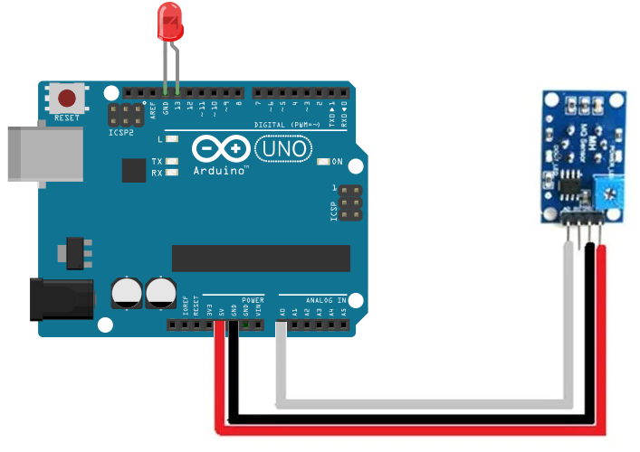

Here's a quikc post on how to read from a CO2 sensor with Johnny-Five using an Arduino. You can get an MQ-135 sensor off Ebay for a couple dollarydoos.
[Source code for this can be found here](https://github.com/SenorGrande/co2-sensor)

## Circuit Setup
Wire ground on the sensor to ground on the Arduino and same with VCC on the sensor to 5V. Connect AD on the sensor to any of the analog ports on the Arduino, I chose A0. If you use a different port, make sure this is reflected in the code!



## Code
To 'calibrate' the sensor and work out what your `co2cal` value should be, leave your sensor near an open window or outside for 10-15 minutes and see what values are logged from the `co2readings` (printed to the console as `i: xxx`).  
Usually you don't need to specify the port your Arduino is on, however, I was developing this on a Windows machine and it wouldn't auto-detect the correct port it was on. I find you can leave this blank on Linux and MacOS.

[Based off of this Johnny Five sensor example](http://johnny-five.io/examples/sensor)

```
const { Board, Sensor } = require("johnny-five");
const board = new Board({port: "COM3"});

// Atmospheric CO2 Level = 400ppm
// Average indoor CO2    = 350-450ppm
var co2readings = []; // array to store raw readings
var co2avg = 0;       // int for raw value of CO2
var co2comp = 0;      // int for compensated CO2
var co2sum = 0;       // int for summed CO2 readings
var co2cal = 75;      // margin of error of the sensor

board.on("ready", () => {
  // Create a new generic sensor instance for
  // a sensor connected to an analog (ADC) pin
  const sensor = new Sensor("A5");

  // When the sensor value changes, log the value
  sensor.on("change", value => {

    if (co2readings.length < 10) {
      co2readings.push(sensor.value);
    } else {
      co2sum = 0
      for (var i in co2readings) {
        console.log("i: ", co2readings[i]);
        co2sum = co2sum + co2readings[i];
      }
      co2avg = co2sum / co2readings.length; // divide total to get avg
      co2comp = co2avg - co2cal; // get compensated value
      console.log("Average CO2: ", co2comp);
      co2readings = [];
    }

  });
});
```

Thanks for reading! Chur 🤙